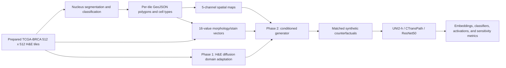
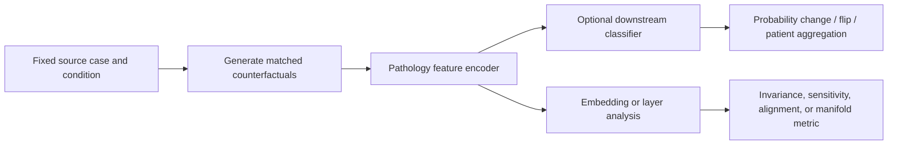

# CPathoGen method

## End-to-end system



## Data contract

Each prepared tile is identified by one stable stem shared across its image,
nucleus annotation, spatial condition, and morphology row:

```text
<stem>.png or <stem>.jpg
<stem>.geojson
<stem>.npz                     # key "map", shape (512, 512, 5)
standardized morphology row    # index <stem>, 16 ordered values
metadata row                   # image/file reference and constant prompt
```

Processing and generation must reject missing or duplicate stems rather than
silently misaligning conditions. A model item contains the normalized H&E
image, five-channel map, 16-value vector, stem, and constant prompt `"he"`.

## Weak cellular annotations

The annotation stage uses the pinned CellViT++
`CellViT-SAM-H-x40-AMP-001` checkpoint. The tile adapter runs the upstream model and CPU
`DetectionCellPostProcessor`, then writes one polygon feature per detected
nucleus. Each feature contains a class at `properties.classification.name` plus
the type probability, centroid, and bounding box. The file-level metadata
records source image dimensions, checkpoint hash, upstream revision, scale, and
source/pair provenance.

The preprocessing code recognizes five classes in a fixed order:

| Channel | Cell type |
|---:|---|
| 0 | Neoplastic |
| 1 | Inflammatory |
| 2 | Connective |
| 3 | Dead |
| 4 | Epithelial |

The class order is part of the model contract. Changing it requires regenerating maps and retraining or explicitly remapping all inputs.

For generator validation, the same annotator can consume a matched-pair
manifest and re-annotate both the baseline and each counterfactual. Their
shared `pair_group_id`, tile stem, and seed support matched comparisons of cell
counts, class composition, nucleus geometry, and spatial organization. Reusing
the same annotator makes changes measurable but does not make them ground truth;
detector bias and sensitivity to synthetic-image artifacts must be reported.

## Spatial-map preprocessing

Spatial preprocessing performs the following operation for each tile:

1. Read nucleus polygons and class labels from GeoJSON.
2. Approximate each polygon location by the mean of its coordinates.
3. Add one impulse at the centroid in the corresponding class channel.
4. Apply a Gaussian filter with sigma 3 independently to every channel.
5. Normalize each nonempty channel by its own peak.
6. Scale to 0-255, convert to `uint8`, and save as compressed NPZ under the key `map`.

The resulting tensor is `(512, 512, 5)` on disk and is converted to `(5, 512, 512)` for PyTorch.

## Morphology/stain preprocessing

Morphology/stain preprocessing computes nucleus-level geometry and intensity
values, aggregates the mean and variance over all nuclei in a tile, then applies
`StandardScaler` across the fitted training tiles.

The 16 columns, in code order, are:

| Index | Feature | Interpretation |
|---:|---|---|
| 0 | `area_mean` | Mean nucleus polygon area |
| 1 | `area_var` | Variance of nucleus area |
| 2 | `eccentricity_mean` | Mean ellipse eccentricity |
| 3 | `eccentricity_var` | Variance of eccentricity |
| 4 | `solidity_mean` | Mean contour area / convex-hull area |
| 5 | `solidity_var` | Variance of solidity |
| 6 | `perimeter_mean` | Mean contour perimeter |
| 7 | `perimeter_var` | Variance of perimeter |
| 8 | `grad_mean` | Mean per-nucleus Sobel gradient magnitude |
| 9 | `grad_var` | Variance of per-nucleus gradient magnitude |
| 10 | `r_mean` | Mean per-nucleus red intensity |
| 11 | `r_var` | Variance of red intensity |
| 12 | `g_mean` | Mean per-nucleus green intensity |
| 13 | `g_var` | Variance of green intensity |
| 14 | `b_mean` | Mean per-nucleus blue intensity |
| 15 | `b_var` | Variance of blue intensity |

These values combine geometry, texture, and RGB/stain proxies. They should not
all be described as biological morphology. A preprocessing bundle contains raw
and standardized tables, the fitted scaler, and the feature-order manifest. The
training split, split hash, and clipping/outlier policy must accompany that
bundle.

## Phase 1: H&E domain adaptation

Phase 1 starts from Stable Diffusion 2.1 base and adapts its UNet to H&E.

- input resolution: 512 x 512;
- prompt: constant `"he"` for every sample;
- training target: diffusion noise prediction;
- trained component: UNet;
- frozen components: VAE and text encoder;
- optional EMA: enabled in the documented cloud command;
- documented cloud run: up to 100,000 steps, with checkpoint 30,000 treated as the best FID checkpoint for phase 2.

Because the prompt is constant, this stage is best understood as H&E domain adaptation rather than general text-conditioned generation.

## Phase 2: spatial concatenation plus FiLM

The supported Phase-2 checkpoint uses direct concatenation plus FiLM, not
ControlNet.

### Spatial branch

`SpatialCondEncoder` downsamples the five-channel map:

```text
(B, 5, 512, 512)
  -> Conv 5->32, stride 2
  -> Conv 32->64, stride 2
  -> Conv 64->128, stride 2
  -> 1x1 Conv 128->4
  -> GroupNorm(1, 4)
  -> (B, 4, 64, 64)
```

The four spatial features are concatenated with the four noisy VAE latent channels. The Stable Diffusion UNet input convolution is expanded from 4 to 8 channels. Original weights are copied into channels 0-3 and channels 4-7 are zero-initialized.

### Morphology/stain branch

A separate FiLM MLP is attached to every module whose class name is `ResnetBlock2D` across the UNet. For a 16-value condition vector, each MLP predicts per-channel scale and shift values, with both clamped to `[-0.5, 0.5]`. The wrapped ResNet output becomes:

```text
output * (1 + gamma) + beta
```

The UNet, spatial encoder, and FiLM MLPs are trained. The VAE and text encoder remain frozen. The cloud command uses separate learning-rate scales for the pretrained UNet and the new spatial encoder.

### Main tensor contract

| Item | Shape | Range/type |
|---|---|---|
| H&E image | `(B, 3, 512, 512)` | normalized to approximately `[-1, 1]` |
| Spatial map | `(B, 5, 512, 512)` | disk `uint8` 0-255; model float 0-1 |
| Spatial features | `(B, 4, 64, 64)` | normalized CNN output |
| Noisy latent | `(B, 4, 64, 64)` | diffusion latent |
| UNet input | `(B, 8, 64, 64)` | latent concatenated with spatial features |
| Morphology/stain vector | `(B, 16)` | standardized values |

## Training objective and checkpoint contents

At each step, the VAE encodes the real H&E image. Noise is added at a random diffusion timestep. The spatial encoder processes the paired map, and the resulting features are concatenated with the noisy latents. The 16-value vector is assigned to the FiLM modules. The UNet predicts noise, and the loss is mean squared error against the scheduler target.

A self-contained Phase-2 inference checkpoint includes:

```text
checkpoint/
├── unet/
│   ├── config.json
│   └── diffusion_pytorch_model.safetensors
├── vae/
├── tokenizer/
├── text_encoder/
├── scheduler/
├── spatial_encoder.pt
├── film_mlps.pt
```

Training checkpoints may additionally contain optimizer, learning-rate
scheduler, and random-state files. The supported inference bundle contains the
expanded UNet, VAE, spatial encoder, FiLM weights, and frozen tokenizer, text
encoder, and diffusion scheduler required for offline generation.

## Inference

The supported conditioned sampler loads the checkpoint and original controls,
applies intervention definitions in memory, and records every pair in a run
manifest. It:

1. Construct a DDIM scheduler from the base training scheduler.
2. Encode the constant `"he"` prompt once and expand it across the batch.
3. Normalize spatial maps to 0-1 and compute four spatial latent channels.
4. Initialize four random latent channels from a fixed seed.
5. Attach the 16-value vectors to all injected FiLM modules.
6. At every denoising step, concatenate noisy and spatial latents into an eight-channel UNet input.
7. Decode final latents with the VAE and convert to RGB PIL images.

Normal evaluation uses independent device-seeded latent noise per tile, exactly
as the historical validation sampler did. Workflow 05 is the explicit
exception: baseline and counterfactual conditions share one cloned latent so
their difference is not sampling noise. The reference inference protocol uses
30 DDIM steps with spatial-control strength 2.0, and supports CUDA, Apple MPS,
and CPU execution.

## Validation and evaluation

Phase-1 and phase-2 validation select up to 2,000 image/map pairs and use TorchMetrics Inception FID. Visual grids are also written at validation checkpoints. In a multi-process run, the selected pairs are sharded across processes, but images/statistics are not gathered before FID is calculated; only the main process's local-shard score is logged. The current distributed validation therefore does not actually report FID over all selected images.

Important qualifications:

- historical validation could fall back to a training subset when an explicit held-out set was absent;
- multi-GPU validation logs only the main process's shard rather than an aggregate over all selected images;
- FID sample provenance is not fully captured in a manifest;
- Inception FID alone does not verify histopathology fidelity or conditioning adherence;
- the paper registry therefore proposes pathology-feature distances and re-segmentation-based spatial/morphology recovery metrics.

## Downstream probing architecture

The foundational experiment pipeline is generally:



Historical studies include single-case probes, large-scale spatial/morphology
sweeps, molecular-subtype heads, color/morphology/noise invariance comparisons,
forward-propagation interventions, LoRA/adapter experiments, layer sweeps, and
embedding visualizations. These are prior research records, not current
validated workflows.

## Implementation versus research narrative

There are three architecture labels in the project record:

| Label | Meaning |
|---|---|---|
| Phase-1 LDM | H&E-adapted diffusion UNet without spatial/morphology conditioning |
| Legacy ControlNet phase 2 | Older checkpoint/narrative architecture with a separate ControlNet branch |
| Direct concat + FiLM | Supported checkpoint: five-channel map encoded to four channels and concatenated with latents; 16-value FiLM conditioning |

Treat **direct concat + FiLM** as the supported architecture until another
method is explicitly selected, versioned, and rerun. Publications must either
describe that method or restore and independently verify a ControlNet model.
