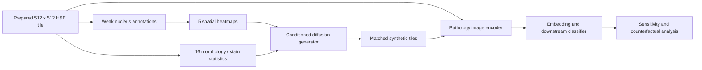

# CPathoGen project

CPathoGen studies whether realistic, controlled H&E counterfactuals can reveal
which cellular, morphological, textural, and stain signals pathology vision
models use. It is a research project, not a clinical system or a substitute for
pathology training.

The proposed central claim is:

> CPathoGen generates realistic, controllable H&E counterfactuals that preserve
> requested cellular spatial structure and morphology, enabling causal probing
> of pathology vision models.

That claim requires separate evidence for image realism, intervention fidelity,
and probing utility. Preliminary artifacts exist, but the complete validation
needed to establish all three is not yet present. The detailed system is in
[Method](METHOD.md), the evaluation plan in [Experiments](EXPERIMENTS.md), and
the evidentiary boundaries in [Limitations](LIMITATIONS.md).

The intended interventions include changing regional cell-type density or
mixing, nuclear area/perimeter/eccentricity/solidity, gradient or stain
statistics, and diffusion seed while holding other controls fixed as far as the
generator permits. Generated images can then be compared through image
encoders, downstream predictions, or recovered cellular measurements.

In scope are controllable histopathology generation, realism and control
fidelity, counterfactual probing, failure analysis, and reproducibility. Not
established are clinical safety, diagnostic validity, biological causality from
generated edits, general-purpose text-to-image generation, or a fully
reproducible public release under one project-wide license.

Use **CPathoGen** for the project and paper. Use **PathOGen** only for historical
generator names, symbols, and checkpoints. Every reported result must name its
architecture: Phase-1 LDM, legacy ControlNet, or direct-concat spatial
conditioning plus FiLM.

## The project in one picture



CPathoGen asks whether a pathology model changes its representation or
prediction when selected visual properties are changed while other inputs are
held as constant as the generator permits. It therefore has two distinct model
families:

1. a **generative model**, which creates controlled synthetic H&E tiles; and
2. **image encoders and classifiers**, which are probed with real and generated tiles.

The Stable Diffusion-derived generator is not a pathology foundation model.
UNI2-h and CTransPath appear in the historical pathology-pretrained encoder
benchmark; ResNet50 is a conventional comparison.

## What pathology foundation models are

A foundation model is pretrained on a large and diverse collection of data so its learned representations can be reused for many downstream tasks. A **pathology foundation model** applies that idea to digitized tissue images, sometimes together with text or molecular data.

Most image-only pathology foundation models used in this project act as **encoders**:

```text
H&E tile -> encoder -> numeric embedding -> task-specific head -> prediction
```

The embedding is a compact vector intended to retain useful visual information. A small task-specific model, often called a **head** or **probe**, can then learn from those vectors rather than training a large image network from scratch.

Important limits:

- “Foundation” describes a pretraining strategy and intended reuse; it does not guarantee clinical validity, fairness, or robustness at a new hospital.
- A tile encoder does not automatically understand an entire whole-slide image. Slide-level work needs a separately defined sampling and aggregation method.
- A useful embedding can encode nuisance factors such as stain, scanner, tissue preparation, or site.
- A classifier trained on top of an embedding inherits both the encoder's biases and the label/split quality of the downstream dataset.
- An image-based prediction of a molecular label is a research estimate, not a molecular assay.

The [UNI2-h model card](https://huggingface.co/MahmoodLab/UNI2-h) describes a large self-supervised histopathology image encoder intended for feature extraction. Its underlying research is reported in [*Towards a general-purpose foundation model for computational pathology*](https://doi.org/10.1038/s41591-024-02857-3). CTransPath combines a convolutional front end with a multiscale Swin Transformer and contrastive pretraining on unlabeled histopathology; see the [primary CTransPath paper](https://doi.org/10.1016/j.media.2022.102559).

## Pathology essentials

### From tissue to pixels

**Histopathology** is the microscopic study of tissue to understand disease. A biopsy or surgical specimen is fixed, processed, embedded, cut into a very thin section, placed on a glass slide, stained, and examined by a pathologist. A scanner converts the glass slide into a **whole-slide image (WSI)**.

CPathoGen receives prepared **tiles** or **patches**, principally 512 x 512
pixels; WSI tiling is outside the current active scope. Pixel count alone does
not define physical scale: micrometres per pixel (MPP), objective magnification,
and any resizing must also be recorded. A 512-pixel tile at one MPP can cover a
very different tissue area from a 512-pixel tile at another MPP.

The data hierarchy matters:

```text
patient -> specimen/case -> slide -> region -> tile -> nucleus
```

Tiles from the same slide or patient are correlated. Randomly splitting tiles can place near-duplicates from one patient in both training and testing, producing **data leakage**. Clinical/generalization evaluation should normally separate patients first.

### What H&E means

**H&E** stands for **hematoxylin and eosin**, the routine stain used for many tissue sections. Hematoxylin makes nuclear chromatin and other basophilic structures appear blue to purple; eosin makes cytoplasm, collagen, and supporting tissue appear pink to red. The [NCI definition of H&E staining](https://www.cancer.gov/publications/dictionaries/cancer-terms/def/h-and-e-staining) gives a concise reference.

For an engineer, the useful mental model is:

| Appearance | Often corresponds to | Caution |
|---|---|---|
| Dark blue/purple objects | Cell nuclei or dense chromatin | Folds, debris, and overstaining can also be dark |
| Pink material | Cytoplasm, collagen, extracellular/supporting tissue | Color depends strongly on preparation and scanning |
| White or pale spaces | Lumina, fat vacuoles, tears, or background | Meaning depends on tissue context |

H&E is morphological, not a direct measurement of gene expression, protein receptors, cell viability, or molecular subtype. Stain concentrations, section thickness, fixation, scanner optics, compression, and laboratory protocols change the colors. These variations can become shortcuts for a model. **Stain normalization** attempts to reduce such variation; **stain augmentation** exposes a model to plausible color changes during training.

### Cells, nuclei, and tissue compartments

A **cell** includes its nucleus, cytoplasm, and membrane. In H&E, nuclei are usually easier to separate than complete cell boundaries, so computational pipelines often segment and classify nuclei and then use a nucleus label as a proxy for a cell label. Documentation should say “nucleus” when that is what the algorithm actually detects.

CPathoGen uses five broad annotation classes in a fixed channel order:

| Channel | Project label | Practical interpretation | Do not assume |
|---:|---|---|---|
| 0 | Neoplastic | Nucleus predicted to belong to tumor/neoplastic tissue | Definitive malignancy or tumor grade |
| 1 | Inflammatory | Predicted immune/inflammatory nucleus | A precise immune-cell lineage |
| 2 | Connective | Predicted stromal/connective-tissue nucleus | A specific fibroblast or stromal state |
| 3 | Dead | Pattern assigned to the dead/necrotic category | A direct per-cell viability measurement |
| 4 | Epithelial | Predicted non-neoplastic epithelial nucleus | Guaranteed benignity or organ-of-origin identity |

These are computational, weak labels in the current workflow, not expert-reviewed truth for every object. “Neoplastic” means exhibiting abnormal proliferative/tumor-associated features; **neoplasm** is abnormal tissue growth. **Stroma** is the supporting connective tissue around epithelial/tumor structures. The **tumor microenvironment** includes tumor cells, immune cells, stroma, vessels, and extracellular material and the spatial interactions among them. **Necrosis** is tissue death, often recognized as a regional morphological pattern rather than by testing the viability of each cell.

### Morphology terms used by the project

**Morphology** means visible form and structure. CPathoGen summarizes segmented nucleus polygons and image intensities over each tile:

| Term | Engineering definition | Interpretation note |
|---|---|---|
| Area | Pixel area enclosed by a nucleus polygon | Physical area requires known MPP |
| Perimeter | Length of the polygon boundary in pixels | Sensitive to segmentation noise and resolution |
| Eccentricity | Elongation of a fitted ellipse; near 0 is rounder, near 1 more elongated | It is a shape descriptor, not a diagnosis |
| Solidity | Polygon area divided by convex-hull area | Lower values often mean a more indented/irregular contour |
| Sobel gradient | Local intensity-edge magnitude | A texture/edge proxy, not purely biological morphology |
| RGB mean | Average red, green, or blue intensity around nuclei | A stain/scanner proxy as well as a tissue signal |
| Mean | Average value across nuclei in a tile | Can hide multiple cell populations |
| Variance | Spread of values across nuclei | Unstable when few nuclei are present |

The project's 16-value condition vector contains the mean and variance of area, eccentricity, solidity, perimeter, Sobel gradient, and RGB intensity features. It mixes geometry, texture, and stain/color. Calling the whole vector simply “morphology” is convenient but incomplete.

### Breast pathology labels are different axes

The workspace contains two distinct task families that should not be conflated:

| Task family | Example labels here | What the label describes |
|---|---|---|
| Histologic category | Normal, Benign, InSitu, Invasive | What the tissue looks like and whether malignant cells are confined or invading |
| Molecular subtype | Basal-like, HER2-enriched, Luminal | Tumor biology derived from receptor and/or molecular profiling conventions |

**In situ** carcinoma is confined to its site of origin and has not invaded surrounding tissue. **Invasive** carcinoma has crossed the normal tissue boundary into surrounding tissue. **Benign** means non-cancerous; “normal” is a dataset label and does not mean the specimen is clinically normal in every respect.

ER (estrogen receptor), PR (progesterone receptor), and HER2 (human epidermal growth factor receptor 2) are clinically important breast-cancer biomarkers. Terms such as Luminal, HER2-enriched, Basal-like, and triple-negative are related but not interchangeable: their exact meaning depends on the assay and labeling scheme. See the [NCI overview of breast-cancer types](https://www.cancer.gov/types/breast/breast-cancer-types). The provenance of `TCGA_BRCA_molecular_subtypes.csv` must therefore be documented before interpreting a benchmark clinically.

## Computational pathology essentials

### Common vision tasks

| Task | Input | Output | Example relevance |
|---|---|---|---|
| Detection | Image | Point or box per object | Approximate nucleus locations |
| Semantic segmentation | Image | Class per pixel | Tissue-region labeling |
| Instance segmentation | Image | Separate mask/polygon per object | Individual nucleus boundaries |
| Object classification | Cropped/detected object | Class per object | Nucleus/cell-type prediction |
| Tile classification | Tile | Label per tile | BACH or molecular-subtype experiments |
| Slide classification | Many tiles from one WSI | Label per slide/patient | Requires tile aggregation |

**CellViT++** is described by its authors as a framework that combines nucleus
instance segmentation with learned cell embeddings and lightweight
classification adaptation; see the [CellViT++ paper](https://arxiv.org/abs/2501.05269).
CPathoGen uses a pinned CellViT-SAM-H x40 model to produce per-nucleus
polygons/classes from real tiles and generated counterfactuals. These remain
model-derived pseudo-labels, not biological ground truth. NuHTC is a historical
alternative segmentation strand and should not be silently substituted.

### Labels, ground truth, and pseudo-labels

- **Ground truth** is a reference annotation used as the target for training/evaluation. In pathology it is still an expert measurement with uncertainty, not perfect truth.
- **Weak labels** provide incomplete, coarse, noisy, or indirect supervision—for example, assigning a slide diagnosis to every tile.
- **Pseudo-labels** are predictions from another model that are reused as if they were labels.
- **Annotation provenance** records who or what produced a label, with which model/version, parameters, and quality checks.
- **Inter-observer variability** is disagreement among human experts; it should be quantified where relevant.

The five cellular maps in this project are derived from model-produced nucleus polygons/classes, so errors propagate into both spatial and morphology conditions. A generator can reproduce annotation-system biases without representing biological truth.

### Encoders, embeddings, and heads

An **encoder** converts an image into learned features. An **embedding** is the resulting numeric representation. A downstream **head** maps embeddings to a task label or score.

- **Linear/logistic regression** is a simple, interpretable baseline on frozen embeddings.
- **Random forest** combines many decision trees and can capture nonlinear feature interactions.
- **XGBoost** builds boosted decision trees sequentially.
- **MLP** (multilayer perceptron) is a feed-forward neural network over embeddings.
- A **linear probe** trains only a simple head while keeping the encoder frozen. It tests how accessible a task signal already is in the representation.
- **Fine-tuning** updates some or all encoder weights for the task. It is more flexible but needs more data and can overfit.
- **MIL** (multiple-instance learning) treats a slide as a bag of tiles and learns to aggregate them when only slide-level labels are available.

### Models and components

| Model/component | Kind | Role in CPathoGen | Key caveat |
|---|---|---|---|
| Stable Diffusion 2.1 base | Latent diffusion generator | Initialization for the H&E generator | General image model before H&E adaptation; not a pathology foundation encoder |
| VAE | Image/latent compressor | Maps 512 x 512 RGB tiles to and from 64 x 64 latent tensors | Reconstruction is lossy |
| UNet | Denoising network | Predicts noise during diffusion training/sampling | Current phase 2 expands its input from 4 to 8 channels |
| Text encoder | Prompt encoder | Encodes the constant prompt `"he"` | Constant text does not provide meaningful semantic control |
| Spatial encoder | Small CNN | Maps five 512 x 512 heatmaps to four 64 x 64 latent channels | Current implementation uses direct concatenation |
| FiLM MLPs | Conditioning modules | Convert the 16 values into feature-wise scales and shifts in UNet ResNet blocks | Controls may interact rather than vary independently |
| UNI2-h | Pathology foundation encoder | Historical 1,536-dimensional tile-embedding benchmark | Gated model access and use terms apply |
| CTransPath | Pathology-pretrained encoder | Historical alternative tile-embedding benchmark | Architecture/weight compatibility must be preserved |
| ResNet50 | Conventional CNN encoder | Non-foundation baseline | ImageNet features are not pathology-specific by default |
| CellViT++ | Nucleus segmentation/classification framework | Produces conditions and repeat measurements on counterfactuals | Pinned model provenance exists; complete cohort QC and external validation remain missing |
| NuHTC | Instance-segmentation framework | Historical alternative nuclei strand | Not the annotator named by the current CPathoGen method |

ResNet introduced residual/skip connections that make deep convolutional networks easier to optimize; the canonical reference is [*Deep Residual Learning for Image Recognition*](https://openaccess.thecvf.com/content_cvpr_2016/html/He_Deep_Residual_Learning_CVPR_2016_paper.html).

## How the generator works

### Latent diffusion in plain language

A diffusion model learns to reverse a process that gradually adds random noise. During generation it starts from noise and repeatedly denoises it. **Latent diffusion** performs this process in a compressed representation rather than directly in 512 x 512 RGB pixels, reducing computation. The [latent diffusion paper](https://openaccess.thecvf.com/content/CVPR2022/html/Rombach_High-Resolution_Image_Synthesis_With_Latent_Diffusion_Models_CVPR_2022_paper.html) describes the approach behind Stable Diffusion.

The main components are:

1. the VAE encodes a real image into a latent tensor;
2. a scheduler adds a known amount of noise at a sampled timestep;
3. the UNet sees the noisy latent and conditioning, then predicts the noise;
4. the training loss compares predicted and actual noise;
5. at inference, a sampler such as DDIM repeatedly updates random latents and the VAE decodes the result.

### CPathoGen's two phases

**Phase 1: H&E domain adaptation.** The UNet starts from Stable Diffusion 2.1 and learns on real H&E tiles. The VAE and text encoder are frozen. Every example uses the prompt `"he"`, so this is better understood as domain adaptation than general text-to-image training.

**Phase 2: structured conditioning.** The current code introduces two control paths:

- five spatial heatmaps are compressed by a small CNN and concatenated with the noisy image latent; and
- the 16-value morphology/stain vector modulates internal UNet features with FiLM.

**FiLM** (feature-wise linear modulation) applies a learned scale and shift to feature channels based on a conditioning vector. Its original formulation is described in the [FiLM paper](https://arxiv.org/abs/1709.07871).

Some posters and older artifacts use the name **ControlNet** for the spatial
control. The published ControlNet architecture adds spatial controls to a frozen
pretrained diffusion model using connected locked/trainable copies and
zero-initialized convolutions; see the [ControlNet paper](https://openaccess.thecvf.com/content/ICCV2023/html/Zhang_Adding_Conditional_Control_to_Text-to-Image_Diffusion_Models_ICCV_2023_paper.html).
The supported checkpoint does **not** use that architecture. It uses a small
spatial encoder followed by direct latent concatenation. Use
“concat-conditioned spatial encoder” unless a true ControlNet model is restored
and separately versioned.

### What the controls actually represent

The five spatial maps are not segmentation masks. Each predicted nucleus polygon is reduced to an approximate center, placed as an impulse in its class channel, blurred with a Gaussian, and normalized per channel. They therefore encode smooth **relative spatial density**, not precise cell outlines or absolute calibrated counts.

The 16-value vector is standardized over a dataset. A value of `+1` means
roughly one fitted-training-set standard deviation above the mean, not “100%
more” of a biological property. The fitted scaler and feature order must travel
with every dataset/model version; a serialized scaler alone does not prove it
was fitted on a leakage-free training split.

## Counterfactuals and model probing

A **counterfactual** asks what a model would do under a specified change. Here, the intended experiment creates a matched image pair with the same random seed and most settings fixed while changing one spatial or morphology condition.

Useful terms:

- **Intervention:** the control variable deliberately changed.
- **Matched pair:** baseline and edited samples generated with shared settings/seed.
- **Fidelity:** whether the generated image actually realizes the requested change.
- **Realism:** whether the output resembles plausible H&E tissue.
- **Sensitivity:** how much an embedding or prediction changes after an intervention.
- **Selectivity:** whether the intended attribute changes more than unrelated attributes.
- **Crosstalk/entanglement:** one control unintentionally changes other properties.
- **Confounder:** a third factor associated with both the intervention and outcome.
- **Shortcut:** a nuisance feature that predicts a label in the dataset but is not the intended biological signal.
- **Distribution shift:** training and deployment/evaluation data differ.
- **Seed:** the random-number state controlling the initial diffusion noise; a shared seed improves matching but does not guarantee that only one visual attribute changes.

## Metrics you will encounter

| Metric | What it measures | Main limitation |
|---|---|---|
| Accuracy | Fraction of correct predictions | Misleading for imbalanced classes |
| Precision | Among predicted positives, fraction correct | Depends on threshold and prevalence |
| Recall/sensitivity | Among actual positives, fraction detected | Does not measure false-positive burden |
| Specificity | Among actual negatives, fraction correctly rejected | Also threshold-dependent |
| F1 score | Harmonic mean of precision and recall | Omits true negatives |
| AUROC | Ranking of positives above negatives across thresholds | Can look optimistic under severe imbalance |
| Macro average | Equal average over classes | Treats rare and common classes equally by design |
| Cosine similarity/distance | Angle between embedding vectors | Representation change is not automatically semantic change |
| Prediction flip rate | Fraction whose predicted class changes | Ignores probability changes without a class flip |
| MAE/correlation | Agreement between requested/measured continuous controls | Correlation can be high despite scale bias |
| FID | Distance between fitted Gaussian distributions of Inception features | Sensitive to sample size/preprocessing; not a pathology or control-fidelity test |

For FID, lower is conventionally better. The original formulation is in [*GANs Trained by a Two Time-Scale Update Rule Converge to a Local Nash Equilibrium*](https://proceedings.neurips.cc/paper/2017/hash/8a1d694707eb0fefe65871369074926d-Abstract.html). FID can say that two image sets have closer generic feature distributions; it cannot prove that nuclei are correct, requested cell types moved as intended, or a pathologist would accept the images.

Always report the evaluation unit. Tile-level confidence intervals are invalid if correlated tiles are treated as independent patients. Aggregate or bootstrap at the patient/slide level when that is the level of the scientific claim.

## Preliminary evidence

Project posters describe controllable cellular spatial structure and tumor
morphology, an approximate generator FID of 56, molecular-subtype benchmarks
across UNI2-h, CTransPath, and ResNet50, and substantial counterfactual
sensitivity. An older abstract reports Phase-1 FID around 62 and early
conditional FID around 102 at 15k steps. A separate legacy ControlNet evaluation
reports 480.8966, while archive/checkpoint names mention FID58.

These numbers come from different architectures, checkpoints, sample sets, or
metric protocols and must not be merged. They are preliminary research
artifacts, not independently reproduced benchmarks. The original posters,
abstract, figures, and plots are retained as project reports.

## Datasets used or represented historically

| Dataset | Contents | Role here | Important boundary |
|---|---|---|---|
| TCGA-BRCA | Breast invasive carcinoma slides and linked research data | Main H&E adaptation and molecular-subtype experiments | Patient-linked controlled-access/open-data rules and provenance apply |
| PanNuke | Nucleus instances across 19 tissue types with five cell categories | Historical segmentation strand | Its taxonomy/annotation process does not automatically match CPathoGen annotations |
| BACH | Breast histology microscopy/WSI data for four-class classification | Historical downstream experiments | Patch labels and contest setup must be preserved when comparing results |

Primary descriptions are available from the [NCI Genomic Data Commons TCGA-BRCA page](https://gdc.cancer.gov/about-data/publications/brca_2012), the [PanNuke paper](https://arxiv.org/abs/2003.10778), and the [BACH challenge paper](https://arxiv.org/abs/1808.04277). A local dataset copy is not necessarily complete or sufficient to reproduce a published cohort.

## Common interpretation mistakes

Avoid these shortcuts when writing code, figures, or papers:

- Do not call every pathology neural network a foundation model.
- Do not call the current spatial branch ControlNet.
- Do not call a nucleus classifier a complete cell-phenotyping assay.
- Do not treat the five weak annotation categories as exhaustive biological cell types.
- Do not describe all 16 conditioning values as morphology; six are gradient/RGB stain-texture statistics and their variances.
- Do not treat H&E prediction of a molecular subtype as the molecular assay itself.
- Do not infer physical nuclear size without MPP and resize provenance.
- Do not split correlated tiles from one patient across train and test.
- Do not use FID alone to claim pathology realism or control fidelity.
- Do not claim biological causality because a classifier changed on generated images.
- Do not compare checkpoints unless preprocessing, sample count, random seeds, and evaluation code are matched.

## Compact glossary

| Term | Meaning in this project |
|---|---|
| Artifact | Non-biological visual change caused by preparation, scanning, compression, or generation |
| Backbone | Main pretrained network used to extract or transform features |
| Batch | Examples processed together in one optimization/inference step |
| Checkpoint | Saved model/training state at a particular step |
| Conditioning | Information supplied to guide generation |
| Domain adaptation | Adjusting a pretrained model to a new data domain such as H&E |
| Encoder | Network that maps an input to a learned representation |
| Epoch | One nominal pass through the training dataset |
| Feature/embedding | Numeric representation computed from an input |
| Frozen | Parameters are used but not updated during training |
| H&E | Hematoxylin-and-eosin tissue stain |
| Heatmap | Image-like array encoding relative spatial intensity/density |
| Inference | Using a trained model to produce outputs |
| Latent | Compressed learned representation used by the diffusion model |
| Nucleus | DNA-containing cell structure; the primary segmented object here |
| Pretraining | Training before adaptation to the current downstream task |
| ROI | Region of interest selected within a slide |
| Tile/patch | Small image crop from a larger slide |
| WSI | Whole-slide image, a digitized glass slide |

## Source and terminology policy

For method claims, the versioned model/checkpoint contract takes priority over
posters and old artifacts. For medical terminology, prefer authoritative
oncology/pathology references and review definitions with a qualified
pathologist. For model behavior, consult the exact paper, model card, checkpoint
license, and software revision used. Record uncertainty explicitly: this is a
research prototype and must not be used for diagnosis or treatment decisions.
