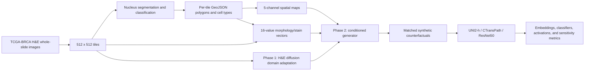
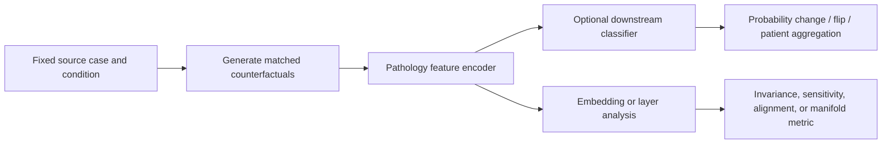

# Architecture

## End-to-end system



## Input contract

The current generator training dataset expects matching file stems across the following structure:

```text
data/
├── interim/
│   ├── tiles/tcga_brca/<stem>.png or <stem>.jpg
│   └── annotations/tcga_brca/geojson/<stem>.geojson
└── processed/generator/
    ├── spatial_maps/<stem>.npz
    ├── morphology_features/
    │   ├── morphology_raw.parquet
    │   ├── morphology_standardized.parquet
    │   ├── scaler.joblib
    │   └── feature_manifest.json
    └── manifests/metadata.jsonl
```

`PathOGenDataset` intersects the morphology table index with available spatial-map files and then assumes that a matching PNG or JPG tile exists. Its returned items contain the normalized H&E image, five-channel map, 16-value vector, stem, and tokenized constant prompt `"he"`.

## Weak cellular annotations

The abstract/poster describes CellViT++ as the annotation producer. Each GeoJSON feature is expected to contain a polygon or multipolygon and a cell class at `properties.classification.name`.

The preprocessing code recognizes five classes in a fixed order:

| Channel | Cell type |
|---:|---|
| 0 | Neoplastic |
| 1 | Inflammatory |
| 2 | Connective |
| 3 | Dead |
| 4 | Epithelial |

The class order is part of the model contract. Changing it requires regenerating maps and retraining or explicitly remapping all inputs.

## Spatial-map preprocessing

`spatial_maps.py` performs the following operation for each tile:

1. Read nucleus polygons and class labels from GeoJSON.
2. Approximate each polygon location by the mean of its coordinates.
3. Add one impulse at the centroid in the corresponding class channel.
4. Apply a Gaussian filter with sigma 3 independently to every channel.
5. Normalize each nonempty channel by its own peak.
6. Scale to 0-255, convert to `uint8`, and save as compressed NPZ under the key `map`.

The resulting tensor is `(512, 512, 5)` on disk and is converted to `(5, 512, 512)` for PyTorch.

## Morphology/stain preprocessing

`morphology_features.py` computes nucleus-level geometry and intensity values, aggregates the mean and variance over all nuclei in a tile, then applies `StandardScaler` across tiles.

The 16 columns, in code order, are:

| Index | Feature | Interpretation |
|---:|---|---|
| 0 | `area_mean` | Mean nucleus polygon area |
| 1 | `area_var` | Variance of nucleus area |
| 2 | `eccentricity_mean` | Mean ellipse eccentricity |
| 3 | `eccentricity_var` | Variance of eccentricity |
| 4 | `solidity_mean` | Mean contour area / convex-hull area |
| 5 | `solidity_var` | Variance of solidity |
| 6 | `perimeter_mean` | Mean contour perimeter |
| 7 | `perimeter_var` | Variance of perimeter |
| 8 | `grad_mean` | Mean per-nucleus Sobel gradient magnitude |
| 9 | `grad_var` | Variance of per-nucleus gradient magnitude |
| 10 | `r_mean` | Mean per-nucleus red intensity |
| 11 | `r_var` | Variance of red intensity |
| 12 | `g_mean` | Mean per-nucleus green intensity |
| 13 | `g_var` | Variance of green intensity |
| 14 | `b_mean` | Mean per-nucleus blue intensity |
| 15 | `b_var` | Variance of blue intensity |

These values combine geometry, texture, and RGB/stain proxies. They should not all be described as biological morphology. The preprocessing script now writes raw and standardized tables, a fitted scaler, and a feature-order manifest. The caller must still enforce a patient/slide-level training split before fitting; split hashes and clipping policy remain external responsibilities.

## Phase 1: H&E domain adaptation

Phase 1 starts from `Manojb/stable-diffusion-2-1-base`. The training script is adapted from the Hugging Face Diffusers text-to-image example.

- input resolution: 512 x 512;
- prompt: constant `"he"` for every sample;
- training target: diffusion noise prediction;
- trained component: UNet;
- frozen components: VAE and text encoder;
- optional EMA: enabled in the documented cloud command;
- documented cloud run: up to 100,000 steps, with checkpoint 30,000 treated as the best FID checkpoint for phase 2.

Because the prompt is constant, this stage is best understood as H&E domain adaptation rather than general text-conditioned generation.

## Phase 2: spatial concatenation plus FiLM

The current `phase2.py` explicitly labels itself “Direct Concat Conditioning (no ControlNet).”

### Spatial branch

`SpatialCondEncoder` downsamples the five-channel map:

```text
(B, 5, 512, 512)
  -> Conv 5->32, stride 2
  -> Conv 32->64, stride 2
  -> Conv 64->128, stride 2
  -> 1x1 Conv 128->4
  -> GroupNorm(1, 4)
  -> (B, 4, 64, 64)
```

The four spatial features are concatenated with the four noisy VAE latent channels. The Stable Diffusion UNet input convolution is expanded from 4 to 8 channels. Original weights are copied into channels 0-3 and channels 4-7 are zero-initialized.

### Morphology/stain branch

A separate FiLM MLP is attached to every module whose class name is `ResnetBlock2D` across the UNet. For a 16-value condition vector, each MLP predicts per-channel scale and shift values, with both clamped to `[-0.5, 0.5]`. The wrapped ResNet output becomes:

```text
output * (1 + gamma) + beta
```

The UNet, spatial encoder, and FiLM MLPs are trained. The VAE and text encoder remain frozen. The cloud command uses separate learning-rate scales for the pretrained UNet and the new spatial encoder.

### Main tensor contract

| Item | Shape | Range/type |
|---|---|---|
| H&E image | `(B, 3, 512, 512)` | normalized to approximately `[-1, 1]` |
| Spatial map | `(B, 5, 512, 512)` | disk `uint8` 0-255; model float 0-1 |
| Spatial features | `(B, 4, 64, 64)` | normalized CNN output |
| Noisy latent | `(B, 4, 64, 64)` | diffusion latent |
| UNet input | `(B, 8, 64, 64)` | latent concatenated with spatial features |
| Morphology/stain vector | `(B, 16)` | standardized values |

## Training objective and checkpoint contents

At each step, the VAE encodes the real H&E image. Noise is added at a random diffusion timestep. The spatial encoder processes the paired map, and the resulting features are concatenated with the noisy latents. The 16-value vector is assigned to the FiLM modules. The UNet predicts noise, and the loss is mean squared error against the scheduler target.

A phase-2 concat checkpoint is expected to include:

```text
checkpoint-<step>/
├── unet/
│   ├── config.json
│   └── diffusion_pytorch_model.safetensors
├── vae/                         # present in some accelerator checkpoints
├── spatial_encoder.pt
├── film_mlps.pt
├── optimizer.bin
├── scheduler.bin
└── random_states_*.pkl
```

The extracted `checkpoint-30000_FID58` contains the expanded UNet, VAE, spatial encoder, and FiLM weights.

## Inference

`inference.generate_concat_conditioned` implements manual conditioned sampling:

1. Construct a DDIM scheduler from the base training scheduler.
2. Encode the constant `"he"` prompt once and expand it across the batch.
3. Normalize spatial maps to 0-1 and compute four spatial latent channels.
4. Initialize four random latent channels from a fixed seed.
5. Attach the 16-value vectors to all injected FiLM modules.
6. At every denoising step, concatenate noisy and spatial latents into an eight-channel UNet input.
7. Decode final latents with the VAE and convert to RGB PIL images.

The helper defaults to 20 DDIM steps and a small batch size intended for V100 memory limits.

## Validation and evaluation

Phase-1 and phase-2 validation select up to 2,000 image/map pairs and use TorchMetrics Inception FID. Visual grids are also written at validation checkpoints. In a multi-process run, the selected pairs are sharded across processes, but images/statistics are not gathered before FID is calculated; only the main process's local-shard score is logged. The current distributed validation therefore does not actually report FID over all selected images.

Important qualifications:

- when `data_val/tiles` is absent, validation falls back to a subset of the training data;
- multi-GPU validation logs only the main process's shard rather than an aggregate over all selected images;
- FID sample provenance is not fully captured in a manifest;
- Inception FID alone does not verify histopathology fidelity or conditioning adherence;
- the paper registry therefore proposes pathology-feature distances and re-segmentation-based spatial/morphology recovery metrics.

## Downstream probing architecture

The foundational experiment pipeline is generally:



The scripts implement single-case probes, large-scale spatial/morphology sweeps, molecular-subtype heads, color/morphology/noise invariance comparisons, forward-propagation interventions, LoRA/adapter experiments, layer sweeps, and embedding visualizations.

## Implementation versus research narrative

There are three architecture labels in the workspace:

| Label | Evidence | Meaning |
|---|---|---|
| Phase-1 LDM | `phase1.py`, `generate_30k_eval.py` | H&E-adapted diffusion UNet without spatial/morphology conditioning |
| ControlNet phase 2 | posters, abstract, `eval_fid_phase2.py`, `phase2_controlnet/` | Older or narrative architecture with a separate ControlNet branch |
| Direct concat + FiLM | current `phase2.py`, `inference.py`, `run_cloud.sh`, extracted FID58 checkpoint | Five-channel spatial map encoded to four channels, concatenated with latents; 16-value FiLM conditioning |

For software documentation and new runs, treat **direct concat + FiLM** as the current implementation until the team explicitly selects and versions another architecture. For papers, either update the method description or restore a verified ControlNet implementation and rerun the reported experiments.
